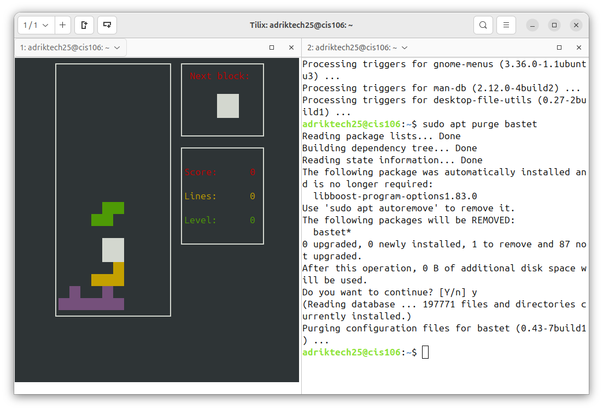
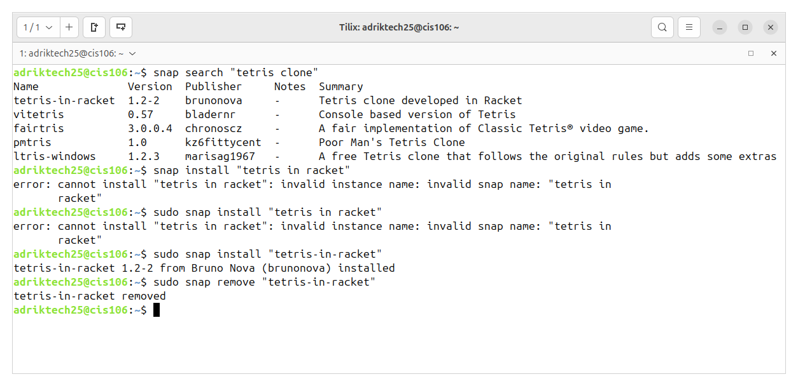

# Week Report 3
## Completed work for week 3

* [Lab 3](../../labs/labs3/lab3.md)
* [Notes 3](../../Notes/notes%203/notes3.md)
  
  ## Practice 

  ### Practice 1
    
  ### Practice 2
    
  ### Practice 3
    
  ### Practice 4
    
  ### Practice 5
    
  ### Practice 6
    
  ### Practice 7
    
  ### Practice 1 - Managing software
    
  ### Practice 3 - Managing software
    