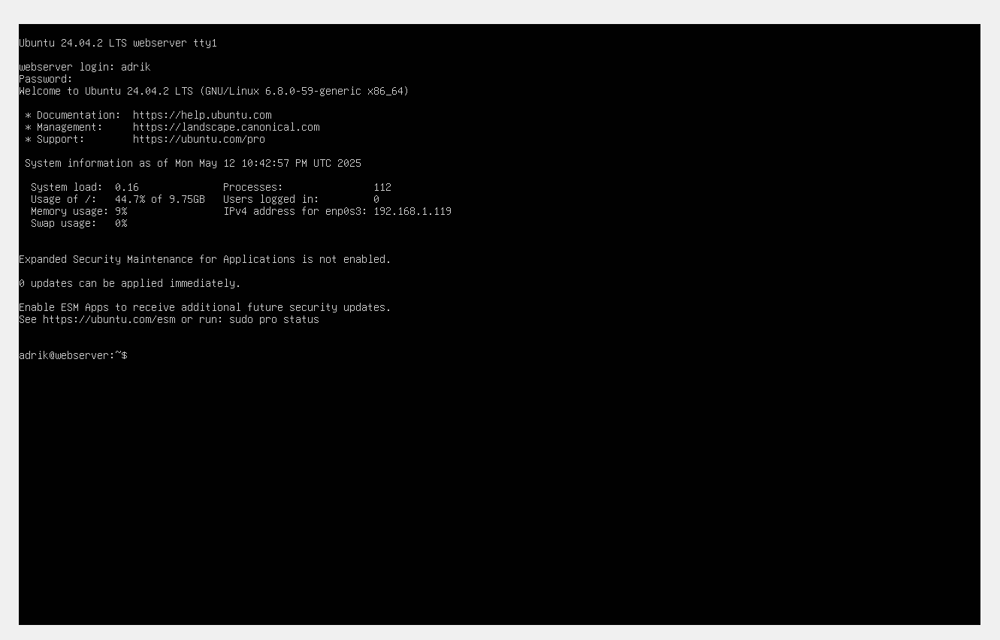
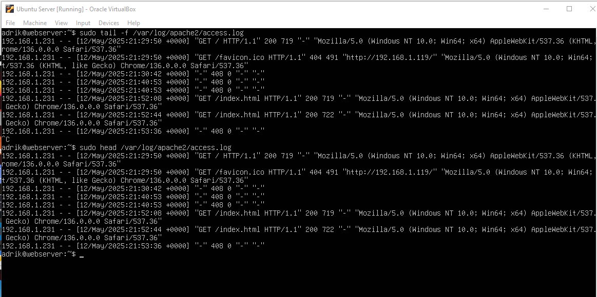

| Name  | Adrik Ojeda |
|-------|-------------|
|Course | cis106      |
|Semester| spring25   | 

# Deliverable 2

### Server Specifications

### Ubuntu Login Screen

### What is the IP address of your Ubuntu Server Virtual Machine?

* 192.168.1.119

### How do you enable the Ubuntu Firewall?

* sudo ufw enable
  * ufw, or "Uncomplicated Firewall", is a command-line tool for managing firewall rules.
    * sudo ufw status
    * sudo ufw disable
    * sudo ufw enable

### How do you check if the Ubuntu Firewall is running?

* sudo ufw status

### How do you disable the Ubuntu Firewall?

* sudo ufw disable

### How do you add Apache to the Firewall?

* sudo ufw allow 'Apache

### What is the command you used to install Apache?

* sudo apt install apache2 -y

### What is the command you use to check if Apache is running?

* systemctl status apache2 --no-pager
  * asystemctl is a command-line tool that allows for the management and monitoring of the systemd system and service manager
    * systemctl reboot
    * systemctl poweroff
    * systemctl get-default

### What is the command you use to stop Apache?

* sudo apachectl stop

### What is the command you use to restart Apache?

* sudo systemctl restart apache2

### What is the command used to test Apache configuration?

* sudo apache2ctl configtest

### What is the command used to check the installed version of Apache?

* apache2 -v

## Definitions and Examples

* systemctl is a command-line tool that allows for the management and monitoring of the systemd system and service manager
    * systemctl reboot
    * systemctl poweroff
    * systemctl get-default

*  ufw, or "Uncomplicated Firewall", is a command-line tool for managing firewall rules.
    * sudo ufw status
    * sudo ufw disable
    * sudo ufw enable

### What are the most common commands to troubleshoot Apache errors? Provide a brief description of each command.

* systemctl
  * Used to control and interact with Linux services via the systemd service manager.
* journalctl
  * Used to query and view the logs that are generated by systemd
* apachectl
  * When troubleshooting, this command is used to check Apache’s configuration.

### Which are the common Apache Log Files, and what are they used for?:

 * The access log and the error log
   * sudo tail -f /var/log/apache2/access.log
   * sudo head /var/log/apache2/access.log

  