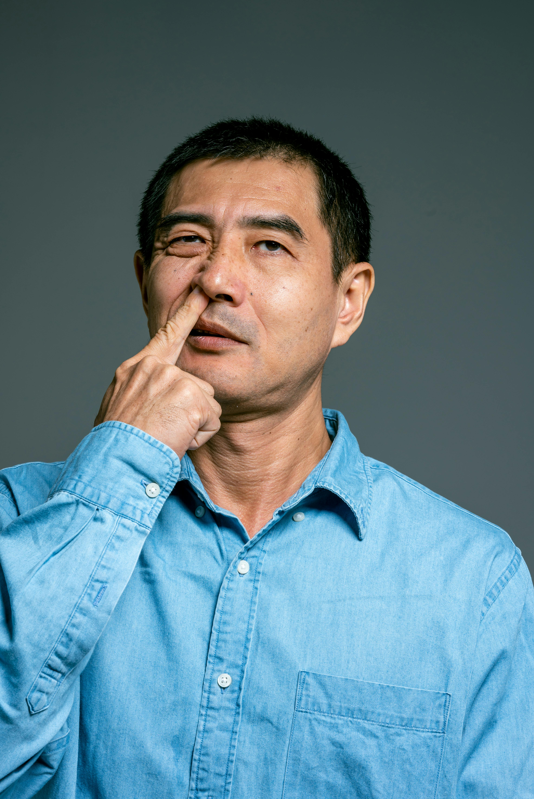

 
# Adrik Ojeda

**Universal Banker**

Performance history of developing strong collaborative relationships and delivering impressive results. Highly motivated banker with extensive customer service and sales experience. Outgoing sales professional with a track record of driving increased revenue, improving buying experience and elevating company profile with targeted markets. Consistently recognized for sales performance and excellence in customer service.

## Experience
### Lego
***Lego Employee • Oct, 2018 — Oct, 2022***
* Provided excellent customer service
* Demonstrated knowledge of products and applications
* Aided customers in their search of specific products
* Arranged stock on sales floor for visual appeal, accessibility, visibility, and cleanliness
* Reconciled backroom stock and floor display items
* Trained incoming employees on store and technical functions

### North Face
***Sales Assossiate • Oct, 2022 — April, 2023***
* Organized racks and shelves to maintain store visual appeal, engage customers and promote specific merchandise.
* Provided positive first impressions to welcome existing, new and potential customers.
* Solved customer challenges by offering relevant products and services.
* Increased sales by offering advice on purchases and promoting additional products.
* Worked alongside retail representatives to enhance product presentations and advertising collateral.

### Columbia Bank
***Universal Teller • April, 2023 — Present***
* Provide exceptional customer service by identifying and fulfilling customer banking needs, including opening new accounts and resolving account issues.
* Educate customers on the bank's products and services, including deposit accounts, CDs, and credit cards.
* Assisted with daily branch operations, including cash handling, balancing the vault, and maintaining accurate records.
* Ensured compliance with all banking regulations and policies.

## Education
### Eastside High School

***High School Diploma • 2017***

## Skills
***Excellent people skills***
* I have several years of experience communicating with customers and peers to attend to their needs to obtain a nice, healthy working environment

***Cash Handling***
* Able to effortlessy handle large sums of cash

***Stocking and replenishing***
* Able to stock shelves at lighnting quick speeds

## Recognition
### Perfect Attendance
***NRC Elementray School • 2010, 2014***
Awarded the Perfect Attendance Achievement award for showing up to school every single day.

### Honor Roll
***Eastside High School • 2014, 2015***
Obtained perfect grades.

## Associations
## Habit
***Volunteer • 2023 - 2025***
Volunteered at events helping the homeless obtain food, tutor kids after school, and help with fundraisers around the holidays.

## Boys and Girls Club
***Youth Development Specialist • 2016-2018***
Responsible for implementing and leading activities with youth in a classroom setting

## Additional Links
[Email](aojeda28249@students.pccc.edu)